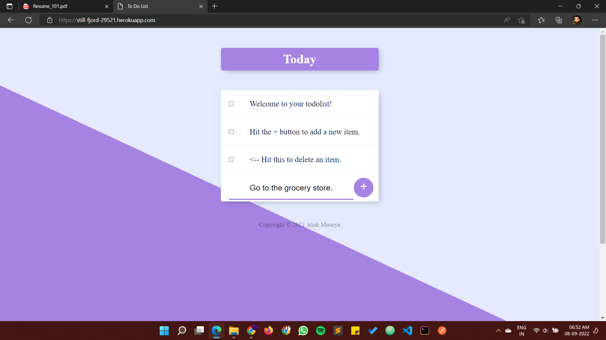
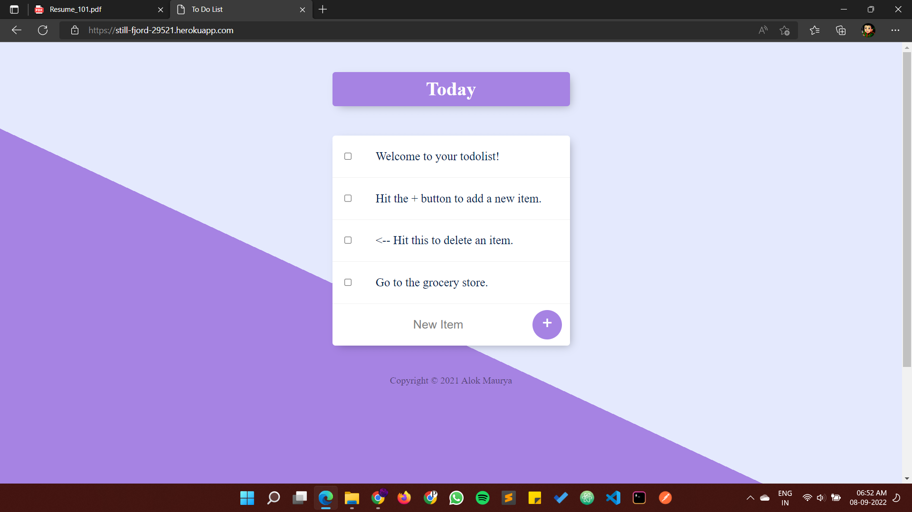

# toDoList APP
## A to-do-list app built with node.js which let users to add and delete items. Users can make new page with different heading by changing route with same name. Back-end built using EJS and express framework; mongoDB as database with mongoose. Using MongoDB Atlas as cloud database and deployed on Heroku server.
[Click here to see Website](https://still-fjord-29521.herokuapp.com/)

## Screenshot for Website.

## Addding task.

## Task added

## Task deleted (by clicking on checkbox)

